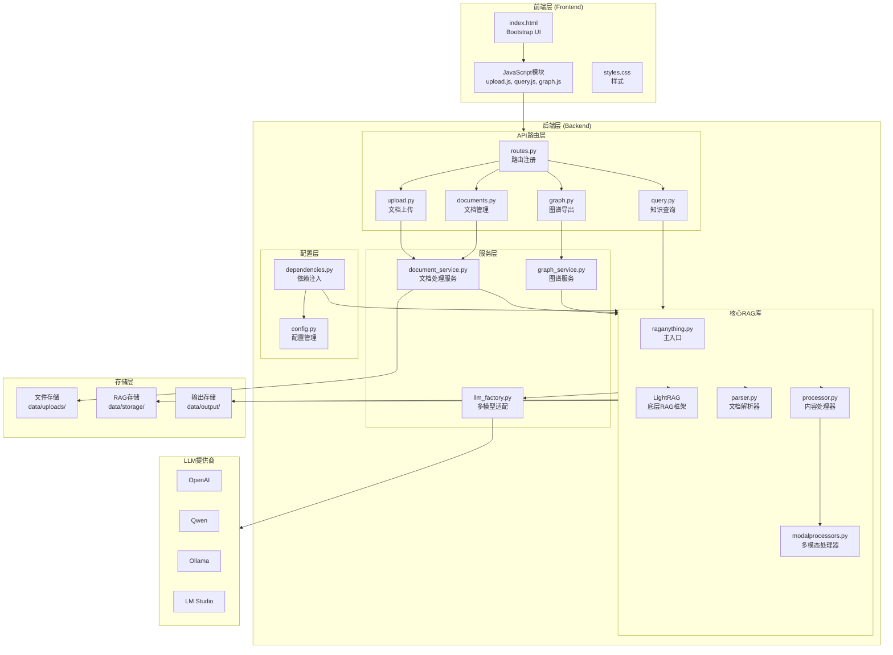
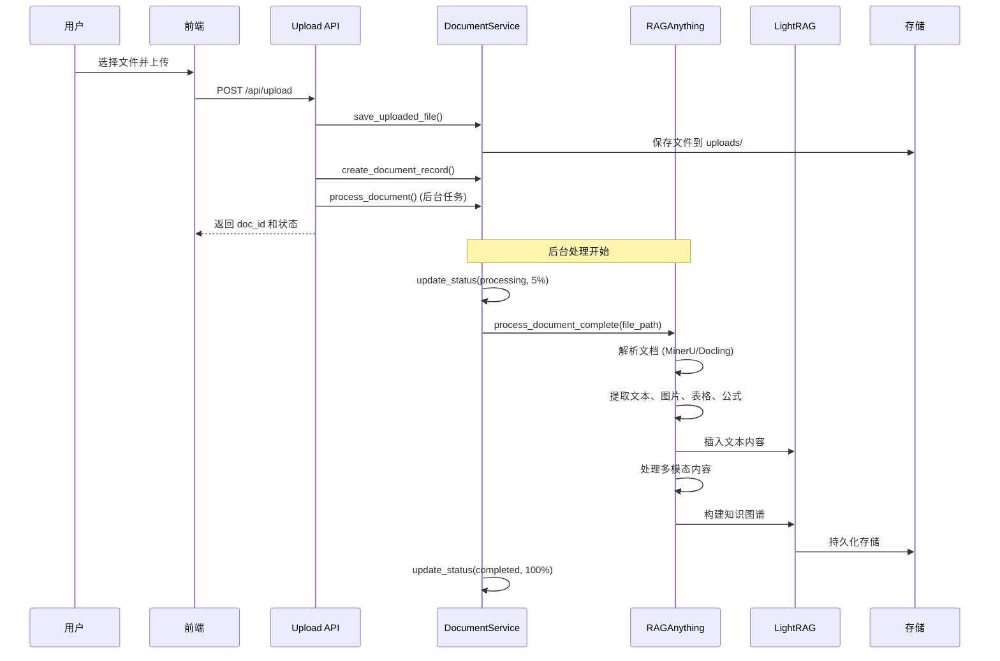
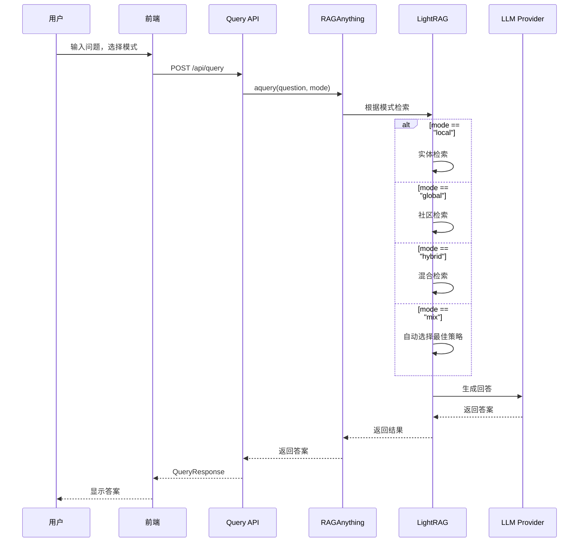
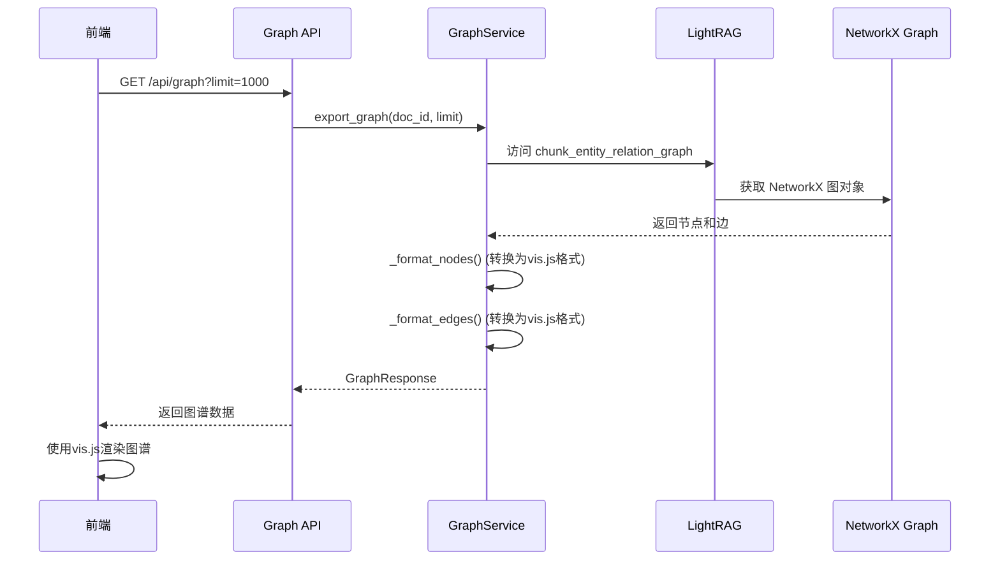

# 多模态知识图谱 RAG 系统 - 架构手册

## 目录

- [1. 项目概述](#1-项目概述)
- [2. 技术架构](#2-技术架构)
- [3. 核心运行流程](#3-核心运行流程)
- [4. 关键组件说明](#4-关键组件说明)
- [5. 数据存储](#5-数据存储)
- [6. 多模型支持](#6-多模型支持)
- [7. 关键技术点](#7-关键技术点)
- [8. 项目优势](#8-项目优势)

---

## 1. 项目概述

### 1.1 系统简介

这是一个基于 **RAGAnything** 和 **LightRAG** 的多模态知识图谱 RAG 系统，支持：

- **文档上传**: 支持 PDF、图片、Office 文档、文本等多种格式
- **智能处理**: 自动解析文档，提取文本、图片、表格、公式等多模态内容
- **知识查询**: 基于处理后的文档进行智能问答，支持多种查询模式
- **图谱可视化**: 交互式 2D 知识图谱展示，可视化实体和关系
- **多模型支持**: 支持 OpenAI、Qwen、Ollama、LM Studio 等多种 LLM 提供商

### 1.2 技术栈

**后端**:
- **FastAPI** - 高性能 Web 框架
- **RAGAnything** - 多模态 RAG 核心库
- **LightRAG** - 底层 RAG 框架
- **Pydantic** - 数据验证
- **NetworkX** - 图数据结构

**前端**:
- **HTML5 + Bootstrap 5** - 响应式界面
- **Vanilla JavaScript** - 原生 JS 实现
- **vis.js** - 图谱可视化

**存储**:
- **LightRAG 内置存储** - 向量存储、图存储、KV 存储
- **文件系统** - 原始文件存储

---

## 2. 技术架构

### 2.1 整体架构图



### 2.2 架构层次说明

系统采用**分层架构**设计，从上到下分为：

1. **前端层**: 用户界面和交互逻辑
2. **API 路由层**: RESTful API 接口定义
3. **服务层**: 业务逻辑处理
4. **核心 RAG 库**: 文档处理和知识图谱构建
5. **配置层**: 配置管理和依赖注入
6. **存储层**: 数据持久化
7. **LLM 提供商**: 外部 AI 服务

---

## 3. 核心运行流程

### 3.1 文档上传与处理流程



**流程说明**:

1. **文件上传**: 用户通过前端上传文件，API 接收并保存到 `data/uploads/` 目录
2. **创建记录**: 在内存中创建文档记录，状态为 `processing`
3. **后台处理**: 使用 FastAPI 的 `BackgroundTasks` 异步处理文档
4. **文档解析**: 使用 MinerU 或 Docling 解析器提取内容
5. **多模态处理**: 分别处理文本、图片、表格、公式
6. **知识图谱构建**: 通过 LightRAG 提取实体和关系，构建知识图谱
7. **状态更新**: 处理完成后更新文档状态为 `completed`

### 3.2 知识查询流程



**查询模式说明**:

- **`local`**: 本地模式，基于实体检索，适合查询特定实体信息
- **`global`**: 全局模式，基于社区检索，适合查询概念性知识
- **`hybrid`**: 混合检索，结合向量和图检索
- **`naive`**: 简单检索，仅使用向量相似度
- **`mix`**: 混合模式（推荐），自动选择最佳策略

### 3.3 知识图谱导出流程



**流程说明**:

1. **请求图谱**: 前端请求知识图谱数据，可指定文档 ID 和节点数量限制
2. **提取图数据**: 从 LightRAG 的 NetworkX 图中提取节点（实体）和边（关系）
3. **格式转换**: 将 NetworkX 格式转换为 vis.js 可视化格式
4. **渲染展示**: 前端使用 vis.js 渲染交互式图谱

---

## 4. 关键组件说明

### 4.1 API 路由层 (`backend/app/api/`)

#### 4.1.1 `routes.py` - 路由注册
统一注册所有 API 路由，包括：
- 文档上传路由
- 文档管理路由
- 查询路由
- 图谱路由

#### 4.1.2 `upload.py` - 文档上传接口
- **端点**: `POST /api/upload`
- **功能**: 接收文件上传，验证文件类型，启动后台处理任务
- **返回**: `UploadResponse` 包含 `doc_id` 和初始状态

#### 4.1.3 `documents.py` - 文档管理接口
- **端点**: 
  - `GET /api/documents` - 获取所有文档列表
  - `GET /api/documents/{doc_id}` - 获取文档状态
- **功能**: 查询文档处理状态和列表

#### 4.1.4 `query.py` - 知识查询接口
- **端点**: `POST /api/query`
- **功能**: 执行知识查询，支持多种查询模式
- **请求**: `QueryRequest` (question, mode, doc_ids)
- **返回**: `QueryResponse` (answer, sources, query_time)

#### 4.1.5 `graph.py` - 知识图谱导出接口
- **端点**: `GET /api/graph`
- **功能**: 导出知识图谱数据
- **参数**: `doc_id` (可选), `limit` (节点数量限制)
- **返回**: `GraphResponse` (nodes, edges, stats)

### 4.2 服务层 (`backend/app/services/`)

#### 4.2.1 `document_service.py` - 文档处理服务

**核心功能**:
- **文件保存**: `save_uploaded_file()` - 保存上传的文件到磁盘
- **状态管理**: `create_document_record()`, `update_status()` - 管理文档处理状态
- **后台处理**: `process_document()` - 异步处理文档的完整流程

**存储机制**:
- **内存存储**: 使用 `_document_store` 字典存储正在处理的文档
- **持久化存储**: 从 LightRAG 的 `doc_status` 存储读取已处理的文档

**处理步骤**:
1. 准备 AI 模型（首次使用需下载）
2. 解析 PDF 文档（提取文本、图片、表格、公式）
3. 处理文本内容
4. 处理多模态内容
5. 构建知识图谱和实体关系

#### 4.2.2 `graph_service.py` - 图谱服务

**核心功能**:
- **图谱导出**: `export_graph()` - 导出知识图谱为 vis.js 格式
- **数据提取**: `_get_graph_data()` - 从 NetworkX 图提取实体和关系
- **格式转换**: `_format_nodes()`, `_format_edges()` - 转换为前端可视化格式

**实体类型颜色映射**:
- `concept`: 绿色 (#4CAF50)
- `person`: 蓝色 (#2196F3)
- `organization`: 橙色 (#FF9800)
- `location`: 紫色 (#9C27B0)
- `table`: 红色 (#F44336)
- `image`: 青色 (#00BCD4)
- `equation`: 黄色 (#FFEB3B)

#### 4.2.3 `llm_factory.py` - LLM 工厂

**核心功能**: 统一适配多种 LLM 提供商，提供一致的接口

**支持的提供商**:
- **OpenAI**: GPT-4o, text-embedding-3-large
- **Qwen**: 通义千问系列（OpenAI 兼容 API）
- **Ollama**: 本地部署模型（qwen2.5:14b, bge-m3:latest）
- **LM Studio**: 本地 OpenAI 兼容 API

**返回函数**:
- `llm_func`: 文本生成函数
- `embedding_func`: 向量嵌入函数
- `vision_func`: 视觉模型函数（用于图片理解）

### 4.3 核心 RAG 库 (`backend/knowledge_graph_rag/`)

#### 4.3.1 `raganything.py` - 主入口类

**核心类**: `RAGAnything`

**主要功能**:
- 集成文档解析、多模态处理、LightRAG
- 提供统一的文档处理和查询接口
- 管理 LightRAG 实例的生命周期

**关键方法**:
- `process_document_complete()`: 完整的文档处理流程
- `aquery()`: 异步查询接口

#### 4.3.2 `parser.py` - 文档解析器

**支持的解析器**:
- **MinerU**: 多模态文档解析器（推荐）
- **Docling**: 文档解析器

**解析能力**:
- PDF 文本提取
- 图片提取
- 表格识别和提取
- 公式识别

#### 4.3.3 `processor.py` - 内容处理器

处理解析后的文档内容，准备插入到 LightRAG。

#### 4.3.4 `modalprocessors.py` - 多模态处理器

**处理器类型**:
- `ImageModalProcessor`: 图片处理
- `TableModalProcessor`: 表格处理
- `EquationModalProcessor`: 公式处理
- `GenericModalProcessor`: 通用处理器

**功能**:
- 提取多模态内容的语义信息
- 生成实体和关系描述
- 插入到知识图谱

#### 4.3.5 `query.py` - 查询功能

提供多种查询模式的实现。

#### 4.3.6 `batch.py` - 批量处理

支持批量处理多个文档。

### 4.4 配置层 (`backend/app/`)

#### 4.4.1 `config.py` - 配置管理

使用 **Pydantic Settings** 管理配置，从 `.env` 文件读取：

**配置项**:
- LLM 配置: `llm_provider`, `llm_model`, `llm_api_key`, `llm_base_url`
- Embedding 配置: `embedding_model`, `embedding_dim`
- 存储配置: `storage_dir`, `upload_dir`, `output_dir`
- 服务器配置: `host`, `port`
- 文档处理配置: `max_concurrent_files`

#### 4.4.2 `dependencies.py` - 依赖注入

**核心功能**:
- **RAGAnything 单例**: `get_rag_instance()` - 确保全局只有一个 RAG 实例
- **配置注入**: `get_settings()` - 提供配置实例

**初始化流程**:
1. 创建 RAGAnything 配置
2. 通过 LLMFactory 创建 LLM 函数
3. 初始化 RAGAnything 实例

### 4.5 前端架构 (`frontend/`)

#### 4.5.1 `index.html` - 主页面

**布局**: 三栏布局
- **左侧**: 文档上传与管理
- **中间**: 知识查询
- **右侧**: 知识图谱可视化

#### 4.5.2 JavaScript 模块 (`assets/js/`)

- **`config.js`**: API 配置和常量定义
- **`upload.js`**: 文件上传逻辑，文档列表管理
- **`query.js`**: 查询逻辑，结果显示
- **`graph.js`**: 图谱渲染逻辑（使用 vis.js）

---

## 5. 数据存储

### 5.1 存储结构

```
data/
├── uploads/          # 上传的原始文件
│   └── doc-{id}_{filename}
├── storage/          # RAG 持久化存储
│   ├── kv_storage/   # 键值存储
│   ├── vector_storage/  # 向量存储
│   ├── graph_storage/   # 图存储
│   └── doc_status/     # 文档状态存储
└── output/          # 解析输出
    └── {doc_id}/    # 每个文档的解析结果
```

### 5.2 存储机制

#### 5.2.1 文件存储 (`data/uploads/`)
- 存储用户上传的原始文件
- 文件名格式: `{doc_id}_{original_filename}`

#### 5.2.2 RAG 存储 (`data/storage/`)
LightRAG 内置的持久化存储机制：
- **KV 存储**: 存储键值对数据
- **向量存储**: 存储文档和实体的向量嵌入
- **图存储**: 存储知识图谱（NetworkX 格式）
- **文档状态存储**: 存储文档处理状态

#### 5.2.3 输出存储 (`data/output/`)
存储文档解析后的中间结果，用于调试和查看。

### 5.3 数据流转

1. **上传阶段**: 文件保存到 `uploads/`
2. **处理阶段**: 解析结果保存到 `output/`
3. **存储阶段**: 处理后的内容插入到 LightRAG 存储
4. **查询阶段**: 从 LightRAG 存储检索相关内容

---

## 6. 多模型支持

### 6.1 LLM 提供商适配

系统通过 `LLMFactory` 统一适配多种 LLM 提供商，提供一致的接口。

### 6.2 支持的提供商

#### 6.2.1 OpenAI
```python
LLM_PROVIDER=openai
LLM_MODEL=gpt-4o
LLM_API_KEY=sk-your-api-key
LLM_BASE_URL=https://api.openai.com/v1
EMBEDDING_MODEL=text-embedding-3-large
EMBEDDING_DIM=3072
```

#### 6.2.2 Qwen (通义千问)
```python
LLM_PROVIDER=qwen
LLM_MODEL=qwen-turbo
LLM_API_KEY=sk-your-qwen-key
LLM_BASE_URL=https://dashscope.aliyuncs.com/compatible-mode/v1
EMBEDDING_MODEL=text-embedding-v1
EMBEDDING_DIM=1536
```

#### 6.2.3 Ollama (本地)
```python
LLM_PROVIDER=ollama
LLM_MODEL=qwen2.5:14b
LLM_BASE_URL=http://localhost:11434
EMBEDDING_MODEL=bge-m3:latest
EMBEDDING_DIM=1024
```

#### 6.2.4 LM Studio (本地)
```python
LLM_PROVIDER=lmstudio
LLM_MODEL=local-model
LLM_BASE_URL=http://localhost:1234/v1
EMBEDDING_MODEL=local-embed-model
EMBEDDING_DIM=1536
```

### 6.3 适配机制

所有提供商都通过统一的函数接口：
- `llm_func(prompt, system_prompt, history_messages, **kwargs)`: 文本生成
- `embedding_func(texts)`: 向量嵌入
- `vision_func(prompt, image_data, messages, **kwargs)`: 视觉理解

---

## 7. 关键技术点

### 7.1 异步处理

- **FastAPI 异步**: 使用 `async/await` 实现异步 API
- **后台任务**: 使用 `BackgroundTasks` 处理耗时的文档处理任务
- **异步查询**: RAGAnything 的 `aquery()` 方法支持异步查询

### 7.2 多模态处理

系统支持处理多种内容类型：
- **文本**: 直接插入到 LightRAG
- **图片**: 使用 Vision 模型提取语义信息
- **表格**: 识别表格结构，提取数据关系
- **公式**: 识别数学公式，提取数学概念

### 7.3 知识图谱构建

- **实体提取**: 从文档中提取实体（概念、人物、组织、地点等）
- **关系提取**: 提取实体之间的关系
- **图存储**: 使用 NetworkX 存储图结构
- **图检索**: 支持基于图的检索策略

### 7.4 持久化存储

LightRAG 提供多种存储后端：
- **内存存储**: 默认使用内存存储（适合开发）
- **PostgreSQL**: 生产环境推荐
- **MongoDB**: NoSQL 存储
- **Neo4j**: 图数据库存储

### 7.5 前后端集成

- **静态文件服务**: FastAPI 直接提供前端静态文件
- **同源访问**: 前后端同源，无需处理 CORS
- **统一部署**: 只需启动后端服务器，前端自动可用

---

## 8. 项目优势

### 8.1 架构优势

1. **分层清晰**: 各层职责明确，易于维护和扩展
2. **松耦合**: 通过依赖注入实现组件解耦
3. **可扩展**: 易于添加新的 LLM 提供商或功能模块

### 8.2 功能优势

1. **多模态支持**: 不仅处理文本，还支持图片、表格、公式
2. **知识图谱**: 可视化实体关系，便于理解知识结构
3. **多种查询模式**: 适应不同的查询场景

### 8.3 技术优势

1. **多模型适配**: 支持多种 LLM 提供商，灵活切换
2. **异步处理**: 提高系统并发性能
3. **持久化存储**: 数据持久化，支持大规模知识库

### 8.4 部署优势

1. **前后端集成**: 无需单独部署前端服务器
2. **配置简单**: 通过 `.env` 文件统一配置
3. **易于启动**: 一键启动，快速部署

---

## 附录

### A. 项目文件结构

```
Multi-Model-Knowledge-RAG-System/
│
├── backend/                          # 后端服务
│   ├── knowledge_graph_rag/          # 核心 RAG 库
│   │   ├── raganything.py           # 主入口
│   │   ├── parser.py                # 文档解析器
│   │   ├── processor.py             # 内容处理器
│   │   ├── modalprocessors.py       # 多模态处理器
│   │   ├── query.py                 # 查询功能
│   │   └── ...
│   ├── app/                          # Web 应用
│   │   ├── api/                      # API 路由
│   │   │   ├── routes.py            # 路由注册
│   │   │   ├── upload.py            # 上传接口
│   │   │   ├── documents.py         # 文档管理
│   │   │   ├── query.py             # 查询接口
│   │   │   └── graph.py             # 图谱接口
│   │   ├── services/                 # 业务逻辑
│   │   │   ├── document_service.py   # 文档服务
│   │   │   ├── graph_service.py      # 图谱服务
│   │   │   └── llm_factory.py       # LLM 工厂
│   │   ├── models/                   # 数据模型
│   │   │   ├── request.py           # 请求模型
│   │   │   └── response.py          # 响应模型
│   │   ├── config.py                 # 配置管理
│   │   ├── dependencies.py           # 依赖注入
│   │   └── main.py                   # 应用入口
│   └── requirements.txt              # Python 依赖
│
├── frontend/                         # 前端
│   ├── index.html                    # 主页面
│   └── assets/                       # 静态资源
│       ├── css/                      # 样式
│       └── js/                       # JavaScript
│
├── data/                             # 数据存储
│   ├── uploads/                     # 上传文件
│   ├── storage/                      # RAG 存储
│   └── output/                       # 解析输出
│
├── README.md                         # 项目说明
├── STARTUP_GUIDE.md                  # 启动指南
└── handbook.md                       # 本手册
```

### B. API 端点列表

| 端点 | 方法 | 说明 |
|------|------|------|
| `/` | GET | 前端主页 |
| `/health` | GET | 健康检查 |
| `/api/upload` | POST | 上传文档 |
| `/api/documents` | GET | 获取文档列表 |
| `/api/documents/{doc_id}` | GET | 获取文档状态 |
| `/api/query` | POST | 知识查询 |
| `/api/graph` | GET | 导出知识图谱 |

### C. 环境变量配置

主要环境变量（详见 `env.example`）:

```env
# LLM 配置
LLM_PROVIDER=openai
LLM_MODEL=gpt-4o
LLM_API_KEY=your-api-key
LLM_BASE_URL=https://api.openai.com/v1

# Embedding 配置
EMBEDDING_MODEL=text-embedding-3-large
EMBEDDING_DIM=3072

# 存储配置
STORAGE_DIR=../data/storage
UPLOAD_DIR=../data/uploads
OUTPUT_DIR=../data/output

# 服务器配置
HOST=0.0.0.0
PORT=8000
```

---

## 更新日志

- **v1.0.0** (2024): 初始版本，支持多模态文档处理和知识图谱构建

---

**文档版本**: 1.0.0  
**最后更新**: 2024年
